# Windowsの場合

既に入っている場合は飛ばしてください。

## 1. gitのインストール

[Git for Windows](https://gitforwindows.org/)

上記のページを開き、「Download」から exeファイルをダウンロードする。

ダウンロードしたexeファイルを開き、インストールを進めてください。

Nextを押します。

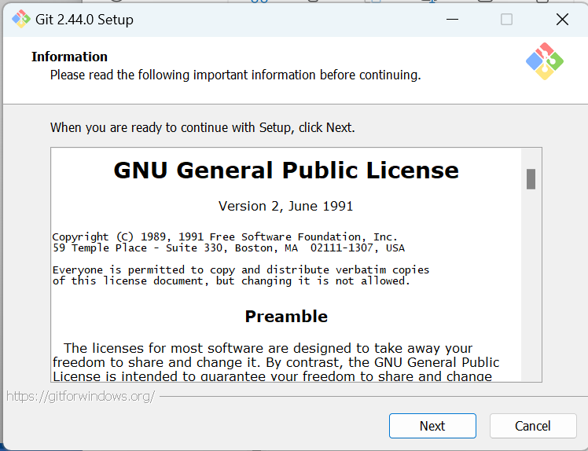

特に変更せずNextを押します。

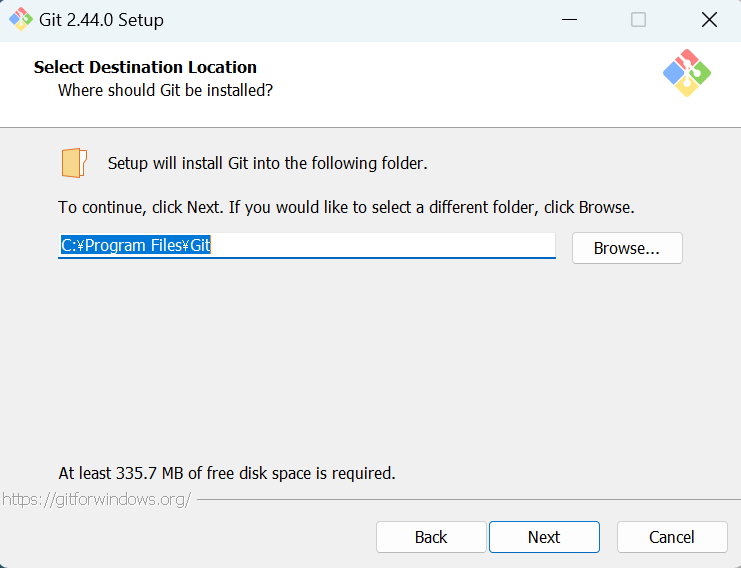

特に変更せずNextを押します。

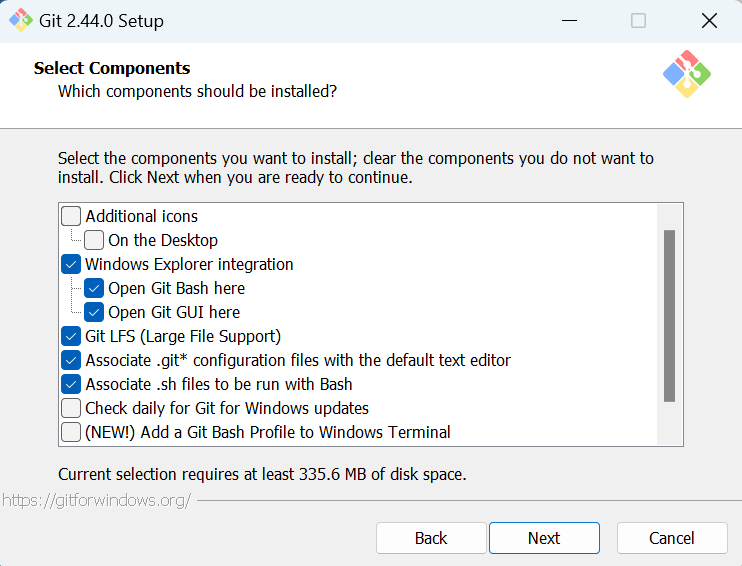

特に変更せずNextを押します。

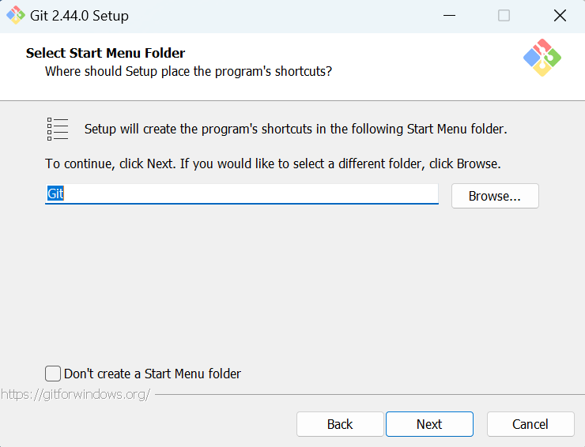

**Use the Nano editor by default**を選択します。

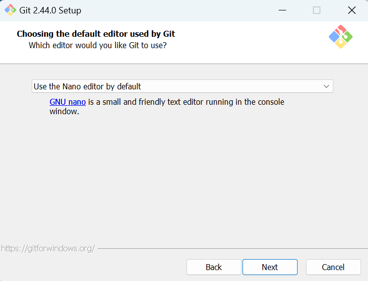

**Override the default branch name for new repositories**を選択。
「main」のまま変更しない。

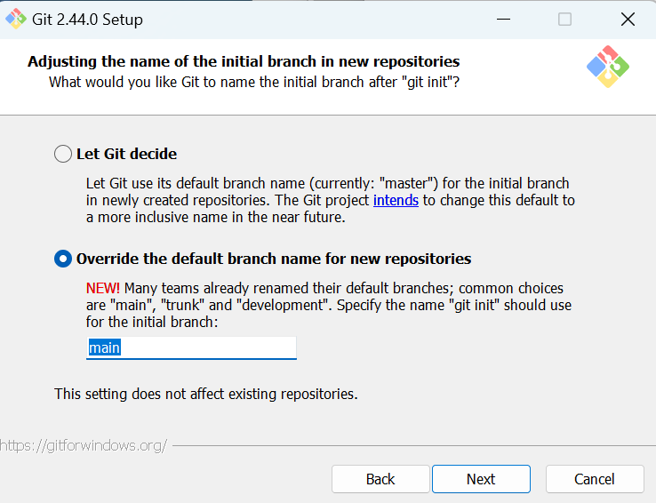

**Git from the command line and also from 3rd-party software**を選択。

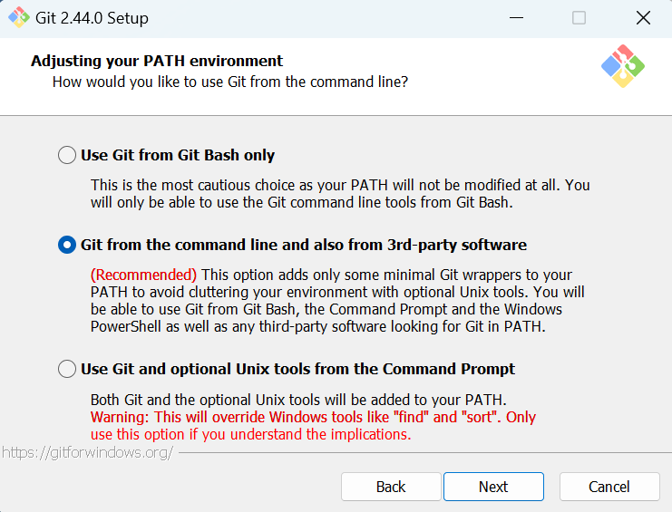

**User bundled OpenSSH**を選択。

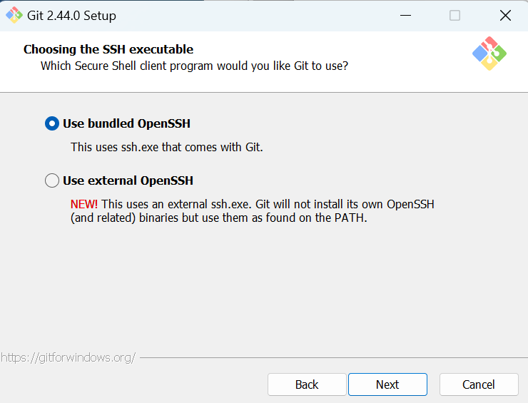

**Use the OpenSSL library**を選択。

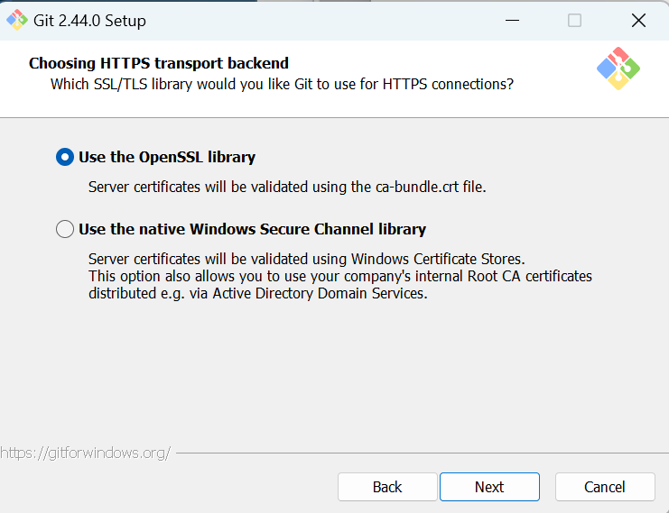

**Checkout Windows-style, commit Unix-style line endings**を選択。

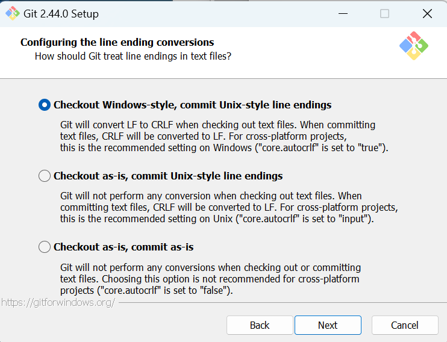

**Use MinTTY (the default terminal of MSYS2)** を選択。

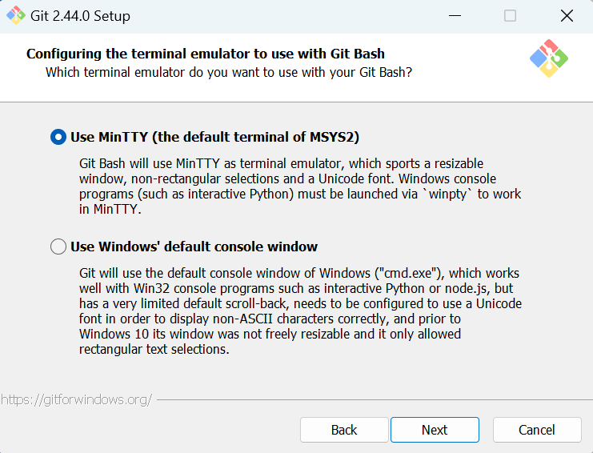

**Fast-forward or merge**を選択。

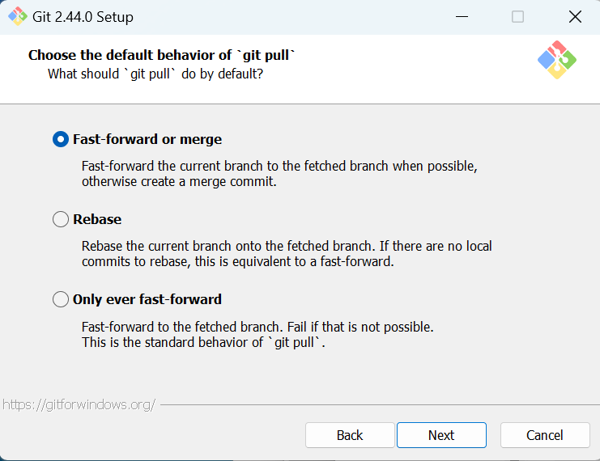

**Git Credential Manager**を選択。

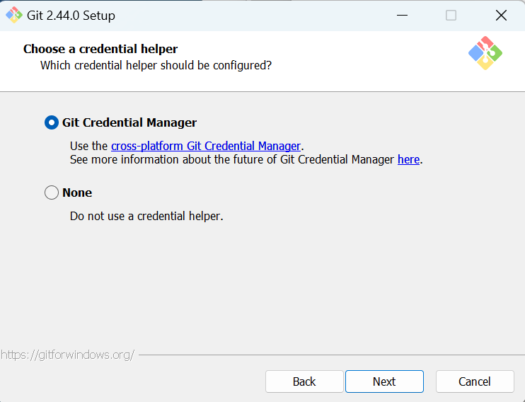

**チェックボックスを全て選択**してNext。

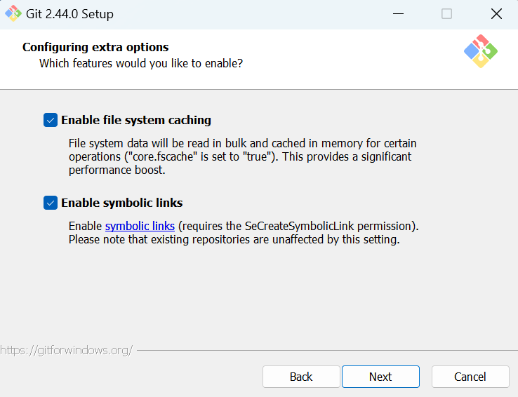

チェックしないでInstallを選択。

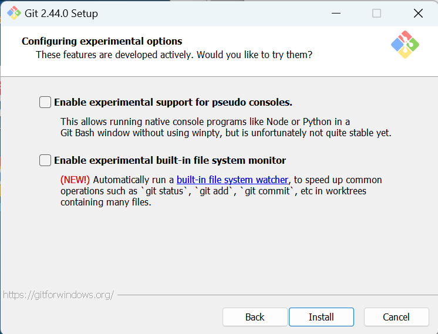

Installされるので待機。

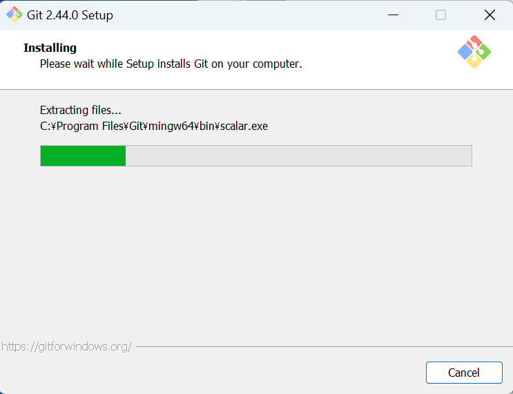

インストールが成功するとこの画面に。Finishを選択。

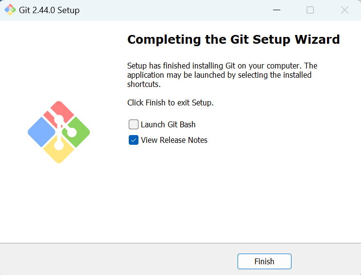

## VSCodeのインストール

[Visual Studio Code - Code Editing. Redefined](https://code.visualstudio.com/)

上記のページを開き、「Download for Windows」から exeファイルをダウンロードする。

ダウンロードしたexeファイルを開き、インストールを進めてください。
特別保存場所などを変更する必要はありません。

## 4. VSCodeの拡張機能のインストール

VSCodeを開き、拡張機能のボタンを選択してください。

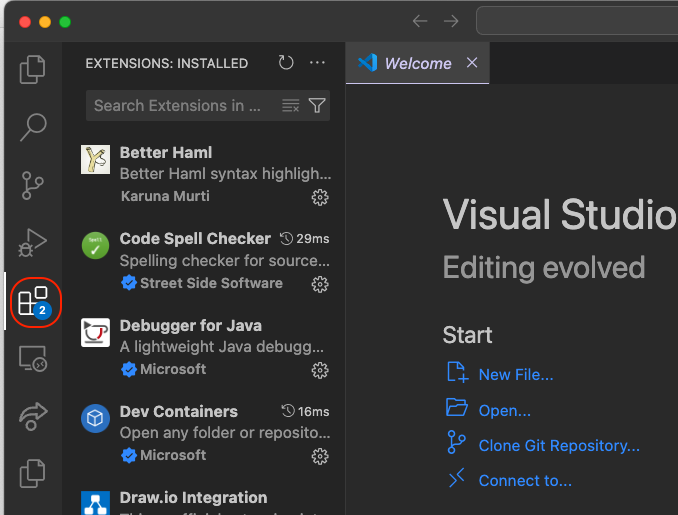

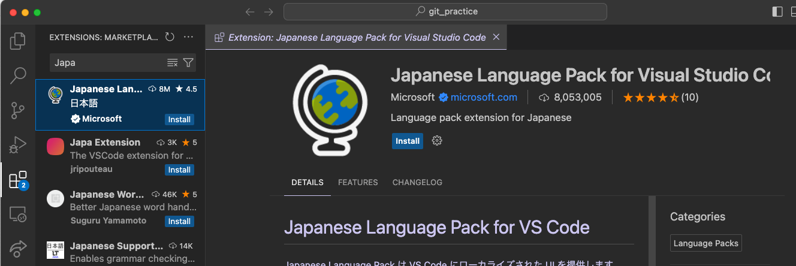

検索窓から次の拡張機能を検索してインストールしてください。

- [Japanese Language Pack for Visual Studio Code](https://marketplace.visualstudio.com/items?itemName=MS-CEINTL.vscode-language-pack-ja)
- [Git Graph](https://marketplace.visualstudio.com/items?itemName=mhutchie.git-graph)
- [GIt History](https://marketplace.visualstudio.com/items?itemName=donjayamanne.githistory)
- [Git Lens](https://marketplace.visualstudio.com/items?itemName=eamodio.gitlens)
- [Markdown All in One](https://marketplace.visualstudio.com/items?itemName=yzhang.markdown-all-in-one)
- [Markdown Preview Enhanced](https://marketplace.visualstudio.com/items?itemName=shd101wyy.markdown-preview-enhanced)

## 6. 最後に

当日は、Visual Studio Codeを使って操作を行うため、
ファイルの開き方、作り方、編集の仕方を使って慣れておいてください。
