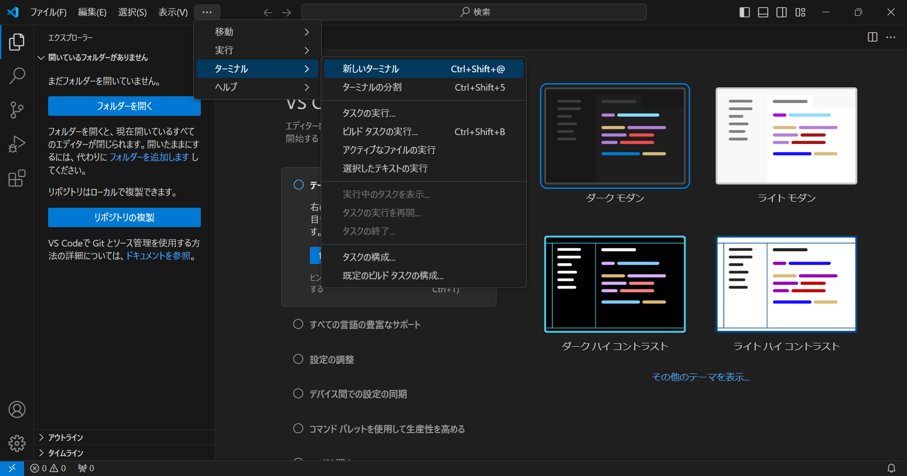
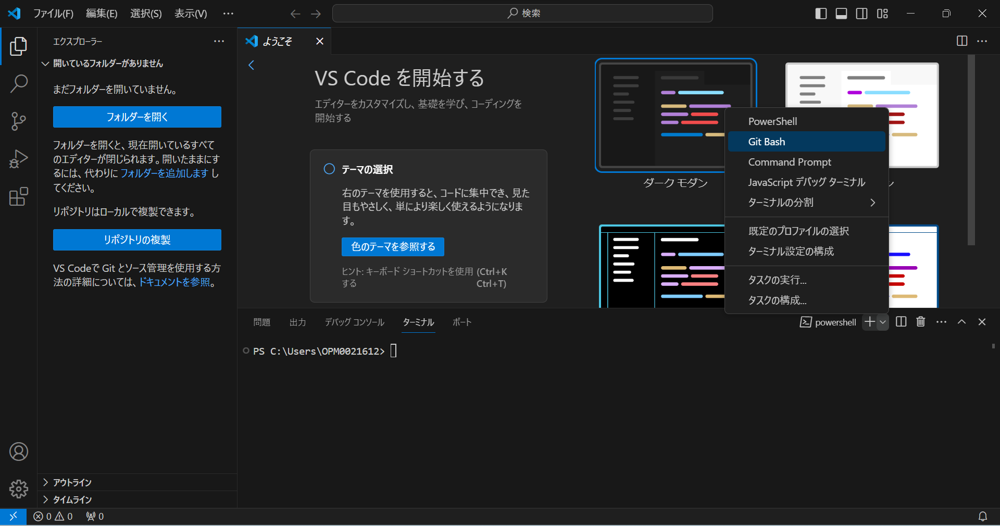
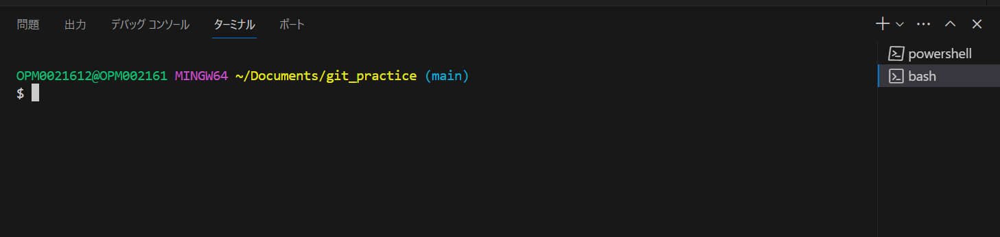
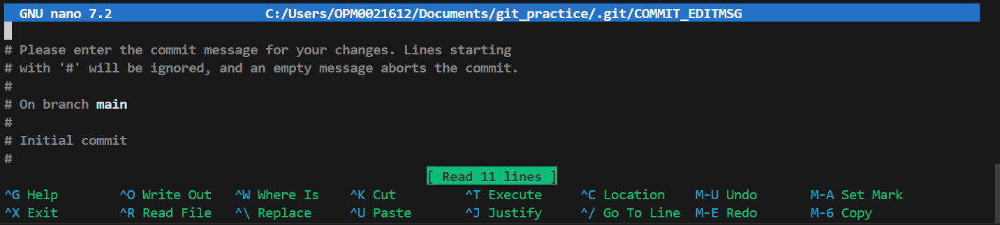
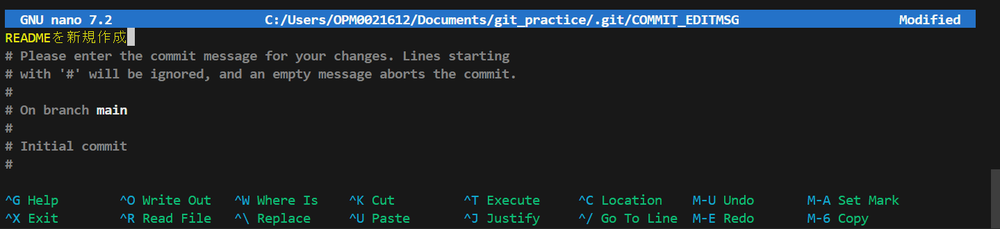
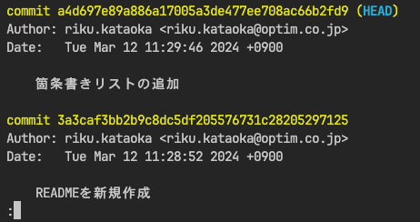

# Gitの基本操作

## 1. 空のフォルダを作成し、VSCodeでフォルダを開く

フォルダ名は「git_practice」
フォルダを信頼しますか?と表示された場合は、信頼するを押して進めてください。

## 2. Gitのコマンドを実行する

ターミナルを開き※1、以下のコマンドで、**ローカルリポジトリ**を作成します。
名前とメールアドレスは適宜変更してください。

メールアドレスは何でも良いです。

コマンドを実行する場所ば、git_practiceの中であることに注意してください。

```bash
# 設定
git config --global user.name "taro.tanaka"
git config --global user.email taro.tanaka@example.com

# Gitリポジトリの作成
git init
```
### ※1 Windowsユーザーの場合

Windowsユーザーの場合、以下のようにターミナルを開くと、`PowerShell`が開かれてしまうため、
**Git Bash**を新たに開いてください。





Git Bashターミナルが開かれると以下のようになります。



## 3. README.md ファイルを作成する

git_practiceのフォルダの中に、「README.md」ファイルを作成する。

中身に以下を記載する。

```md
# 見出し

## 箇条書きの例

- 箇条書き1
- 箇条書き2
- 箇条書き3
```

Gitのリポジトリの中にファイルを作成したので、次のコマンドで『変更点』を確認することが出来る。

```bash
git status
```

結果

```bash
% git status
On branch main

No commits yet

Untracked files:
  (use "git add <file>..." to include in what will be committed)
        README.md

nothing added to commit but untracked files present (use "git add" to track)
```

`Untracked files`、つまりGitの管理下ではないファイルが追加されていることを表している。

## 4. add(ステージング)する

READMEファイルをステージングする。

```bash
git add ./README.md
```

もしくは以下のコマンドで、カレントディレクトリ配下を全てaddすることもできます。

```bash
git add .
```

ステージングされたことを確認するためにも、`git status`を実行する。

```bash
git status
```

結果

```bash
% git status
On branch main

No commits yet

Changes to be committed:
  (use "git rm --cached <file>..." to unstage)
        new file:   README.md
```

`Changes to be committed`、つまりコミット対象の変更点として追加された。

## 5. commit(コミット)する

ステージングした結果をコミットする。

```bash
git commit
```

コマンドを実行すると「nano」というエディターが開く。




そのまま文字を入力できるため、コミットメッセージは、「READMEを新規作成」としてください。



保存して閉じるには

1. Ctrl + O を同時押し
2. Enterキーを押す
3. Ctrl + X を同時押し

今回はこの操作しか使用しないため覚えておいてください。

## 6. commitされたことを確認する

commitはセーブポイントを記録(ログ)する行為。

そのログを確認するコマンドが、`git log`。

```bash
git log
```

結果

```bash
% git log
commit 3a3caf3bb2b9c8dc5df205576731c28205297125 (HEAD -> main)
Author: riku.kataoka <riku.kataoka@optim.co.jp>
Date:   Tue Mar 12 11:28:52 2024 +0900

    READMEを新規作成
```

## 7. READMEの中身を変更して追加commitを行う

先ほど追加した、「README.md」を次のように変更してください。

```md
# 見出し

## 箇条書きの例

- 箇条書き1
- 箇条書き2
- 箇条書き3

## 番号付きリストの例

1. リスト1
2. リスト2
3. リスト3
```

手順4, 5, 6を参考に、add, commit, logを行ってください。
コミットメッセージは、「箇条書きリストの追加」としてください。

```bash
git log
```

結果

```bash
% git log
commit a4d697e89a886a17005a3de477ee708ac66b2fd9 (HEAD -> main)
Author: riku.kataoka <riku.kataoka@optim.co.jp>
Date:   Tue Mar 12 11:29:46 2024 +0900

    箇条書きリストの追加

commit 3a3caf3bb2b9c8dc5df205576731c28205297125
Author: riku.kataoka <riku.kataoka@optim.co.jp>
Date:   Tue Mar 12 11:28:52 2024 +0900

    READMEを新規作成
```

このようにコミットされていれば成功です。

また、logを実行した際、以下のように最後に「:」が表示され操作を受け付けなくなる場合があります。



これは 「lessコマンド」が使われており、画面に収まらない出力を見やすくするためのものです。

- q キーでlessを終了する
- j キー または Enterキーで下にスクロールする
- k キーで上にスクロールする

参考リンク: [lessコマンドとは - 意味をわかりやすく - IT用語辞典 e-Words](https://e-words.jp/w/less%E3%82%B3%E3%83%9E%E3%83%B3%E3%83%89.html)
