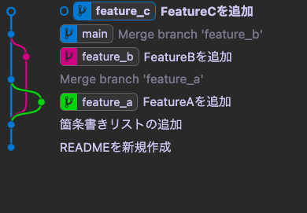

# Gitの基本操作

## 1. 古い地点にswitchする

今回は、feature_aとfeature_bを作った番号付きリストを追加したコミットに戻り、
feature_cブランチを作成します。

そのため、ブランチに対してではなく、コミットハッシュに対してswitchを行います。

まずは、箇条書きリストの追加を行ったコミットハッシュを特定するために、logを実行します。

```bash
git log
```

結果

```bash
% git log
commit 702f063a89efc6fdf1a2382eaa439f5ef8e11624 (HEAD -> main)
Merge: a368288 7e03b5c
Author: riku.kataoka <riku.kataoka@optim.co.jp>
Date:   Tue Mar 12 15:24:03 2024 +0900

    Merge branch 'feature_b'

commit 7e03b5cc2e5f72050410949ecbb89728bee10519 (feature_b)
Author: riku.kataoka <riku.kataoka@optim.co.jp>
Date:   Tue Mar 12 14:25:08 2024 +0900

    FeatureBを追加

commit a36828847f1c7535248f6731330009d55151966b
Merge: a4d697e bf02562
Author: riku.kataoka <riku.kataoka@optim.co.jp>
Date:   Tue Mar 12 14:09:35 2024 +0900

    Merge branch 'feature_a'

commit bf025624f8bc0ab6c19cebfc4c8569a1538f236a (feature_a)
Author: riku.kataoka <riku.kataoka@optim.co.jp>
Date:   Tue Mar 12 12:52:13 2024 +0900

    FeatureAを追加

commit a4d697e89a886a17005a3de477ee708ac66b2fd9
Author: riku.kataoka <riku.kataoka@optim.co.jp>
Date:   Tue Mar 12 11:29:46 2024 +0900

    箇条書きリストの追加
```

皆さんの環境によって異なりますが、例では「a4d697e89a886a17005a3de477ee708ac66b2fd9」であることがわかりました。

`git swtich`コマンドを`-d`オプション付きで実行します。
対象はコミットハッシュです。

```bash
git switch -d a4d697e89a886a17005a3de477ee708ac66b2fd9
```

Tips:
`-d`オプションは、detached HEADというHEADがbranchを指す状態ではない(コミットハッシュを指す)ことを示す。
通常は、branchがコミットハッシュを指すため、`HEAD → branch → コミットハッシュ`という関係性になるが、
detached HEADは`HEAD → コミットハッシュ`となるため、特殊な状態となっている。

git logを実行すると、次のようになっている。

```bash
git log
```

結果

```bash
% git log
commit a4d697e89a886a17005a3de477ee708ac66b2fd9 (HEAD)
Author: riku.kataoka <riku.kataoka@optim.co.jp>
Date:   Tue Mar 12 11:29:46 2024 +0900

    箇条書きリストの追加

commit 3a3caf3bb2b9c8dc5df205576731c28205297125
Author: riku.kataoka <riku.kataoka@optim.co.jp>
Date:   Tue Mar 12 11:28:52 2024 +0900

    READMEを新規作成
```

HEADがcommitを指す形となり、READMEの状態も元に戻った。
これが、Gitで履歴を管理しているから出来ることとなっている。

## 2. 古い地点から、feature_cブランチを作成し、commitする

```bash
git branch feature_c
git switch feature_c
```

ここまでの演習を参考に次のことをしてください。

- 新たに「FeatureC.md」というファイルを作成する
	- 中身は空でOK
- READMEに以下の行を追加する

```md
# 見出し

## 箇条書きの例

- 箇条書き1
- 箇条書き2
- 箇条書き3

## 番号付きリストの例

1. リスト1
2. リスト2
3. リスト3

## 機能一覧

- FeatureC
```

変更を行ったら結果は次のようになるはずです。

結果

```bash
% git log
commit 597569dc46fe5c7b43bc28835b6d19733dd269a4 (HEAD -> feature_c)
Author: riku.kataoka <riku.kataoka@optim.co.jp>
Date:   Tue Mar 12 16:00:52 2024 +0900

    FeatureCを追加

commit a4d697e89a886a17005a3de477ee708ac66b2fd9
Author: riku.kataoka <riku.kataoka@optim.co.jp>
Date:   Tue Mar 12 11:29:46 2024 +0900

    箇条書きリストの追加

commit 3a3caf3bb2b9c8dc5df205576731c28205297125
Author: riku.kataoka <riku.kataoka@optim.co.jp>
Date:   Tue Mar 12 11:28:52 2024 +0900

    READMEを新規作成
```

## 3. feature_cブランチをmainブランチにrebaseする


現在では、「箇条書きリストの追加」のcommitから分岐しているブランチを、
mainから分岐するようにrebaseします。

rebaseは現在のブランチを付け替える作業であるため、作業ブランチは付け替えたいブランチになります。
rebaseコマンドでは、付け替えたい先である`feature_c`を指定します。

```bash
git switch feature_c
git rebase main
```

結果

```bash
 % git rebase main
Auto-merging README.md
CONFLICT (content): Merge conflict in README.md
error: could not apply 597569d... FeatureCを追加
hint: Resolve all conflicts manually, mark them as resolved with
hint: "git add/rm <conflicted_files>", then run "git rebase --continue".
hint: You can instead skip this commit: run "git rebase --skip".
hint: To abort and get back to the state before "git rebase", run "git rebase --abort".
Could not apply 597569d... FeatureCを追加
```

このようにコンフリクトが発生します。
ここで行われているのは、rebaseしようとしているブランチ`feature_c`の、`FeatureCを追加`というcommitを、
mainブランチに再適用します。

git logを実行すると、mainに移動していることが分かります。

```bash
git log
```

結果

```bash
% git log
commit 702f063a89efc6fdf1a2382eaa439f5ef8e11624 (HEAD, main)
Merge: a368288 7e03b5c
Author: riku.kataoka <riku.kataoka@optim.co.jp>
Date:   Tue Mar 12 15:24:03 2024 +0900

    Merge branch 'feature_b'

commit 7e03b5cc2e5f72050410949ecbb89728bee10519 (feature_b)
Author: riku.kataoka <riku.kataoka@optim.co.jp>
Date:   Tue Mar 12 14:25:08 2024 +0900

    FeatureBを追加

commit a36828847f1c7535248f6731330009d55151966b
Merge: a4d697e bf02562
Author: riku.kataoka <riku.kataoka@optim.co.jp>
Date:   Tue Mar 12 14:09:35 2024 +0900
```

git statusを実行すると、mergeでコンフリクトを起こした時同様に、
自動的に適用される`FeatureC.md`とコンフリクトしている`README.md`があります。

```bash
git status
```

結果

```bash
% git status
interactive rebase in progress; onto 702f063
Last command done (1 command done):
   pick 597569d FeatureCを追加
No commands remaining.
You are currently rebasing branch 'feature_c' on '702f063'.
  (fix conflicts and then run "git rebase --continue")
  (use "git rebase --skip" to skip this patch)
  (use "git rebase --abort" to check out the original branch)

Changes to be committed:
  (use "git restore --staged <file>..." to unstage)
        new file:   FeatureC.md

Unmerged paths:
  (use "git restore --staged <file>..." to unstage)
  (use "git add <file>..." to mark resolution)
        both modified:   README.md
```

README.mdはFeatureCが追加される形で修正します。

```md
上部省略。

## 機能一覧

- FeatureA
- FeatureB
- FeatureC
```

そして、`git add`を行った後、`commit`ではなく`git rebase --continue`コマンドを実行します。

```bash
git add .
git rebase --continue
```

これにより、「FeatureCを追加」のcommitを再度行う画面が表示されるため、保存して終了します。

```bash
% git rebase --continue
[detached HEAD 259dfff] FeatureCを追加
 2 files changed, 1 insertion(+)
 create mode 100644 FeatureC.md
Successfully rebased and updated refs/heads/feature_c.
```

今回は1コミットのみをrebaseしているため、処理が完了しました。

```bash
% git log
commit 259dfff3e62c973b55d685eea7e561ab1a68ff96 (HEAD -> feature_c)
Author: riku.kataoka <riku.kataoka@optim.co.jp>
Date:   Tue Mar 12 16:00:52 2024 +0900

    FeatureCを追加

commit 702f063a89efc6fdf1a2382eaa439f5ef8e11624 (main)
Merge: a368288 7e03b5c
Author: riku.kataoka <riku.kataoka@optim.co.jp>
Date:   Tue Mar 12 15:24:03 2024 +0900

    Merge branch 'feature_b'

commit 7e03b5cc2e5f72050410949ecbb89728bee10519 (feature_b)
Author: riku.kataoka <riku.kataoka@optim.co.jp>
Date:   Tue Mar 12 14:25:08 2024 +0900

    FeatureBを追加
```



FeatureCがmainから分岐していることになっています。

## 4. mainにマージする

復習として、feature_cブランチをmainにマージしてください。


